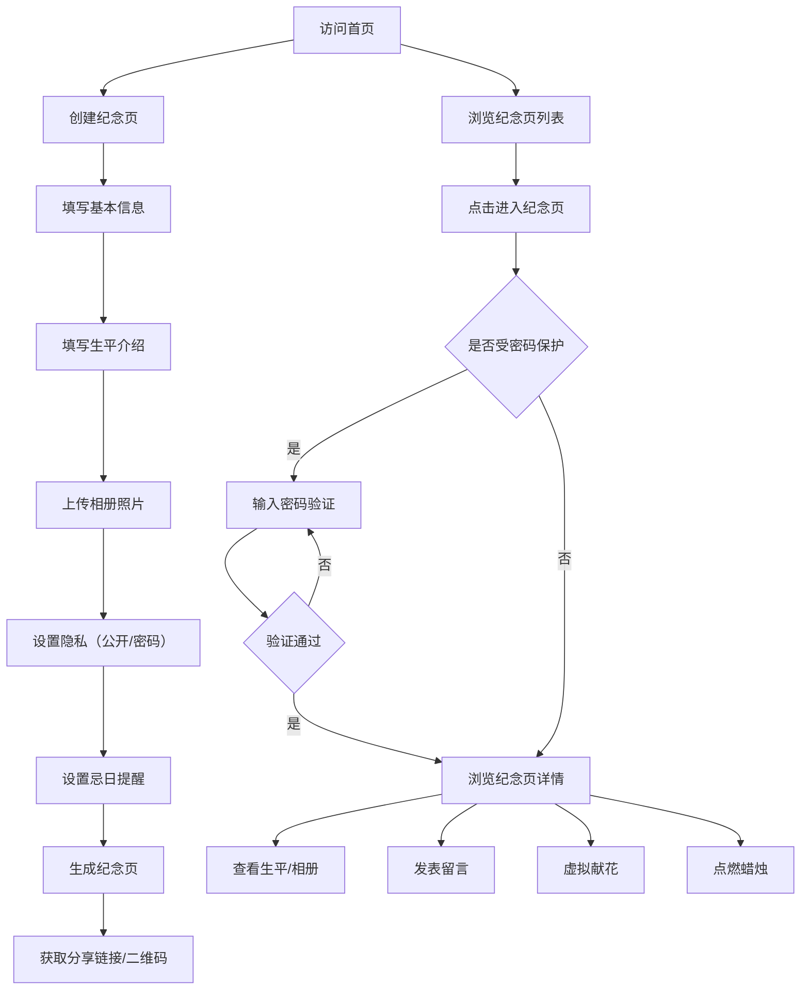

## 1. 产品概述

电子墓碑纪念网站是一个让用户为逝去的亲人创建专属数字纪念页的平台，提供生平介绍、相册展示、留言墙、虚拟献花与点烛等功能，支持公开访问或密码保护，无广告无社交干扰，让思念有一个安静、纯粹的归宿。

- 核心价值：为逝者打造一片宁静的数字安息之地，让生者可以随时缅怀、寄情
- 目标用户：希望为逝去亲人建立线上纪念空间的所有人

## 2. 核心功能

### 2.1 用户角色

| 角色 | 注册方式 | 核心权限 |
|------|----------|----------|
| 创建者 | 无需注册，本地管理 | 创建、编辑、删除纪念页，管理密码和提醒设置 |
| 访问者 | 无需注册 | 浏览公开纪念页，献花点烛，留言（受密码保护的需输入密码） |

### 2.2 功能模块

1. **首页**：纪念页列表展示、创建入口、搜索功能
2. **纪念页创建/编辑**：基本信息、生平介绍、相册上传、密码设置、提醒设置
3. **纪念页详情**：生平展示、相册轮播、留言墙、虚拟献花、点烛台
4. **二维码铭牌**：生成纪念页二维码，可下载打印
5. **忌日提醒**：本地提醒设置，纪念日通知

### 2.3 页面详情

| 页面名称 | 模块名称 | 功能描述 |
|----------|----------|----------|
| 首页 | 纪念页列表 | 卡片式展示所有纪念页，支持搜索，按创建时间排序 |
| 首页 | 创建入口 | 醒目的"创建纪念页"按钮，引导用户开始 |
| 创建页 | 基本信息 | 姓名、生卒年月、头像、一句话简介 |
| 创建页 | 生平介绍 | 富文本生平描述，支持分段 |
| 创建页 | 相册管理 | 多张照片上传，支持拖拽排序，设置封面 |
| 创建页 | 隐私设置 | 公开/密码保护切换，设置访问密码 |
| 创建页 | 提醒设置 | 忌日提醒开关，提前提醒天数设置 |
| 详情页 | 头部区域 | 逝者姓名、生卒年月、头像、一句话简介 |
| 详情页 | 生平介绍 | 完整生平文字展示 |
| 详情页 | 相册展示 | 图片网格 + 灯箱大图查看 |
| 详情页 | 留言墙 | 访客留言展示，支持发表留言 |
| 详情页 | 献花区 | 多种鲜花选择，点击献花，动画效果，献花计数 |
| 详情页 | 点烛台 | 虚拟蜡烛，点击点燃，烛光摇曳动画，蜡烛计数 |
| 详情页 | 二维码 | 页面二维码展示，扫码直接访问 |
| 详情页 | 密码验证 | 受保护页面的密码输入界面 |
| 提醒中心 | 提醒列表 | 所有设置了提醒的纪念页，显示距离忌日天数 |

## 3. 核心流程

用户首次访问首页，浏览已有的纪念页或点击"创建纪念页"。创建过程中依次填写基本信息、生平介绍、上传照片、设置隐私和提醒。创建完成后生成专属纪念页，可分享链接或二维码。访客访问纪念页，可浏览生平、查看相册、留言、献花、点烛。如果是密码保护的页面，需要先输入密码验证。

## 4. 用户界面设计

### 4.1 设计风格

**设计方向：庄重宁静 · 温暖缅怀**

- **主色调**：深墨绿 `#1a3a2f` 为主，象征生命与永恒
- **辅助色**：暖金色 `#c9a962` 点缀，烛光与温暖
- **背景色**：米白色 `#f8f5f0` 基调，柔和宁静
- **点缀色**：深灰 `#3d3d3d` 文字，蜡烛暖橙 `#e8a87c`

- **按钮风格**：圆角矩形，优雅的悬停过渡效果
- **字体**：标题使用「思源宋体」类衬线字体，庄重典雅；正文使用「思源黑体」类无衬线字体，清晰易读
- **布局风格**：留白充足，卡片式布局，层次分明
- **图标风格**：线性图标，简洁优雅，统一描边粗细
- **整体氛围**：宁静、温暖、肃穆、有温度的纪念空间

### 4.2 页面设计概览

| 页面名称 | 模块名称 | UI元素 |
|----------|----------|--------|
| 首页 | Hero区域 | 大标题「让思念有处安放」，温暖的背景图，创建按钮 |
| 首页 | 纪念页列表 | 卡片网格，每张卡片含头像、姓名、生卒年、一句话简介 |
| 详情页 | 头部 | 大尺寸头像，姓名与生卒日期，分隔装饰线 |
| 详情页 | 生平区 | 优雅的排版，首字下沉，行间距舒适 |
| 详情页 | 相册区 | 瀑布流/网格布局，hover放大效果 |
| 详情页 | 献花点烛区 | 鲜花图标阵列，蜡烛动画效果，数字统计 |
| 详情页 | 留言墙 | 便签式留言卡片，错落有致 |
| 详情页 | 二维码区 | 简洁的二维码展示，下载按钮 |

### 4.3 响应式

- 桌面端优先设计，适配移动端
- 移动端卡片单列布局，触控区域优化（44px最小点击区域）
- 献花点烛等交互在移动端保持良好体验

### 4.4 交互动效

- 蜡烛火焰：CSS动画实现摇曳的烛光效果
- 献花动画：花朵从底部飘升至指定位置，渐入效果
- 页面切换：优雅的淡入淡出过渡
- 滚动效果：元素渐次进入视口的揭示动画
- 悬停效果：微妙的缩放和阴影变化
