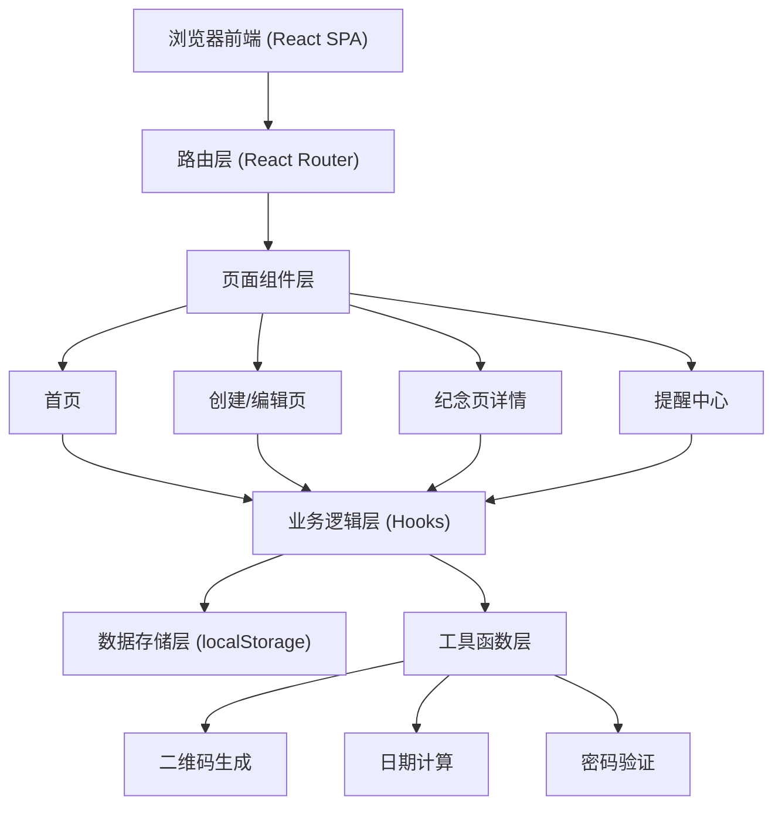
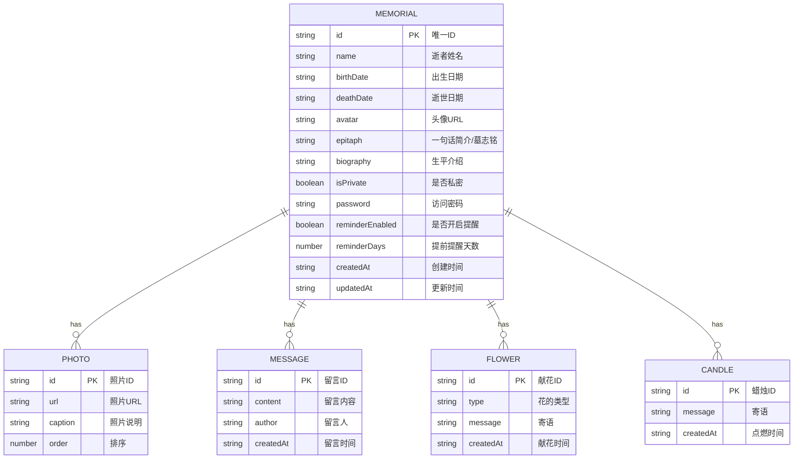

## 1. 架构设计

本项目为纯前端单页应用，数据存储在浏览器 localStorage 中，无需后端服务。纪念页通过唯一ID访问，支持URL参数直接访问特定纪念页。



## 2. 技术描述

- **前端框架**：React@18 + TypeScript
- **构建工具**：Vite@5
- **样式方案**：TailwindCSS@3
- **路由管理**：react-router-dom@6
- **二维码生成**：qrcode.react
- **数据存储**：localStorage（浏览器本地存储）
- **图标**：lucide-react
- **初始化方式**：使用 vite 创建 React + TypeScript 项目

## 3. 路由定义

| 路由 | 页面 | 功能说明 |
|------|------|----------|
| `/` | 首页 | 纪念页列表、搜索、创建入口 |
| `/create` | 创建页 | 创建新的纪念页 |
| `/edit/:id` | 编辑页 | 编辑已有纪念页（需要密码验证） |
| `/memorial/:id` | 详情页 | 纪念页展示（受保护的需密码验证） |
| `/reminders` | 提醒中心 | 忌日提醒列表和设置 |

## 4. 数据模型

### 4.1 数据模型定义



### 4.2 数据存储结构

数据以 JSON 格式存储在 localStorage 中，key 为 `memorials`，值为纪念页数组。

```typescript
interface Photo {
  id: string;
  url: string;
  caption: string;
  order: number;
}

interface Message {
  id: string;
  content: string;
  author: string;
  createdAt: string;
}

interface Flower {
  id: string;
  type: string;
  message: string;
  createdAt: string;
}

interface Candle {
  id: string;
  message: string;
  createdAt: string;
}

interface Memorial {
  id: string;
  name: string;
  birthDate: string;
  deathDate: string;
  avatar: string;
  epitaph: string;
  biography: string;
  photos: Photo[];
  messages: Message[];
  flowers: Flower[];
  candles: Candle[];
  isPrivate: boolean;
  password: string;
  reminderEnabled: boolean;
  reminderDays: number;
  createdAt: string;
  updatedAt: string;
}
```

## 5. 核心功能模块

### 5.1 纪念页管理

- 创建纪念页：收集表单数据，生成唯一ID，保存到localStorage
- 编辑纪念页：验证密码后更新数据
- 删除纪念页：验证密码后删除记录
- 搜索纪念页：按姓名模糊搜索

### 5.2 隐私保护

- 公开/私密切换
- 密码设置与验证（简单MD5哈希存储）
- 受保护页面访问验证

### 5.3 互动功能

- 虚拟献花：多种花型选择，动画效果，计数统计
- 点烛：蜡烛动画效果，计数统计
- 留言墙：发表留言，展示留言列表

### 5.4 二维码

- 根据纪念页URL生成二维码
- 支持下载二维码图片

### 5.5 忌日提醒

- 计算距离忌日的天数
- 浏览器通知提醒（Notification API）
- 提醒中心页面展示所有纪念日

## 6. 第三方库

| 库名 | 用途 |
|------|------|
| `react-router-dom` | 路由管理 |
| `qrcode.react` | 二维码生成 |
| `lucide-react` | 图标库 |
| `tailwindcss` | CSS框架 |

## 7. 性能与安全

- 图片压缩：上传前压缩图片以节省存储
- 数据持久化：localStorage有5MB限制，需注意图片大小
- 密码安全：密码使用哈希存储，纯前端加密仅作基础防护
- 数据备份：建议用户定期导出数据
